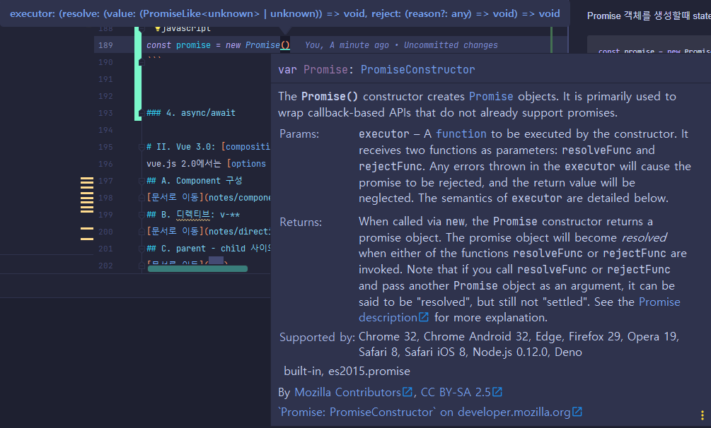

### 1. async vs sync
javascript는 synchronous : 동기적인 언어.

Execute the cod block by order after hoisting.
: 호이스팅이 된 후의 코드 블럭을 연산진행.

hoisting : var, function 등의 선언을 모든 연산 중 제일 먼저 처리하도록 하는 것.
```javascript
    // sync
console.log(1);
console.log(2);
console.log(3);
// console: 1 2 3 순차적으로 표시

    // async
console.log(1);//순차적 진행
setTimeout(()=>{//browser에게 요청
    console.log(2);
},1000);
console.log(3);
// console: 1,3,...(1초 뒤)...2
```
### 2. callback
callback 함수도 두가지 방식 중 선택할 수 있다.

Synchronous callback
```javascript
function printImmediately(print){
    print();
}
printImmediately(()=>console.log("Immediately!"));
//console: 1,3,Immediately....2
```
Asynchronous callback
```javascript
function printWithDelay(print,timeout){
    setTimeout(print,timeout);
}
printWithDelay(()=>console.log("Delay!!"),2000);
//console.log: 1,3,Immediately,...2....Delay!!
//timeout으로 지정한 ms에따라 순서가 달라진다.
```
위험) 콜백 지옥
```javascript
//server
const checkUser = (id,password)=>{
    return (id === "abc" && password==="123")||(id==="asd"&&password==="456");
}
// /server
class UserStorage{
    loginUser(id,password,onSuccess,onError){
        setTimeout(()=>{
            if(checkUser(id,password)){
                onSuccess(id);
            }else{
                onError(new Error("not found"))
            }
        },2000);
    }
    getRoles(user,onSuccess,onError){
        if(user==="abc"){
            onSuccess({name:"abc",role:"admin"});
        }else{
            onError(new Error("required Authority"))
        }
    }
}
//callback
const userStorage = new UserStorage
const userId = prompt("id 입력");
const password = prompt("pw 입력");
userStorage.loginUser(//callback 안에
    userId,
    password,
    id=>{
        return 
        userStorage.getRoles(//callback 안에 ...
            id,
            user=>alert(`id: ${user.name}, role: ${user.role}`),
            err=>console.error(err)
        );
    },
    err=>console.error(err));
```
문제점
```asciidoc
    1. 읽기 어려움
    2. 비즈니스 로직의 이해가 어려움
    3. error가 발생하면 위치 찾기도 어려움
    ...
```
### 3. Promise
Promise Object: javascript built in library for asynchronous operation

Promise 객체의 구성
```asciidoc
    State: pending -> fulfilled or rejected
:   Promise 객체의 요구조건(params, 내부 여건 등)이 만족되면 fulfilled state를,
    그렇지 않으면 rejected state를 획득. 
    그에따라 처리되는 callback이 결정됨
    
    Promise객체의 처리과정
    Producer: 선언, 연산
    Consumer: 반환 후 연결
```
#### a. Producer
Promise 객체를 생성할때 state에 따라 작용할 callback을 제시한다. 제시된 callback은 자동적으로 실행된 상태.



```javascript
/* 
remember!! When tne Promise is created, the executor runs automatically!!
*/
const promise = new Promise((resolve, reject)=>{
    //doing som heavy work(network, read files...)
    console.log("doing something...");
    setTimeout(()=>{
        resolve("elie");
    },2000);
});
```
#### b. Consumer: then, catch, finally
```asciidoc
    then(resolveFunction)
    catch(rejectFunction)
    finally(상태와 관계없이 마지막 동작 function)
```
```javascript
promise
    .then(returnedValue=>{
        console.log(returnedValue);
        const modifiedValue = returnedValue.property;
        return modifiedValue;
    }).then(chainValue=>{//위의 return을 받아서 연속적으로 콜백 처리
        console.log(chainValue);
    }).catch(error=>{
        console.error(error)
    }).finally(()=>{
        console.log("done");
    });
```
사용 예시
```javascript
//Producer
const fetchNumber = new Promise((resolve,reject)=>{
    setTimeout(()=>resolve(1),1000);//1초
});
//Consumer
fetchNumber
    .then(num=>num*2)
    .then(num=>num*3)
    .then(num=>{
        return new Promise((resolve,reject)=>{
            setTimeout(()=>resolve(num - 1),2000)//2초
        });
    })
    .then(num=>console.log(num))
    .catch(err=>console.log(err))
    .finally();
```
Promise를 여러개 쓰는 경우
```javascript
const getUser = ()=>
    new Promise((resolve,reject)=>{
        setTimeout(()=>resolve("userName"),1000);
});
const checkRole = user =>
    new Promise((resolve,reject)=>{
        setTimeout(()=>resolve("ROLE_ADMIN"),2000);
    });
const getBoardAuth = role=>
    new Promise((resolve,reject)=>{
        setTimeout(()=>resolve("able to write"),3000);
    });

getUser()
    .then(user=>checkRole(user))
    //param을 하나만 받아서 바로 전달하는 경우 생략가능
    .then(/*role=>*/getBoardAuth/*(role)*/)
    .then(console.log);
```

catch Error!!
```javascript
getUser()
    .then(checkRole)
    .then(getBoardAuth)
    .catch(err=>{//원하는 시점에 에러대응 가능
        //error인 경우에 대한 임시 조치도 가능
        return "ROLE_TEMP";
    })
    .then(console.log)
    .catch(console.log);
//err마지막에만 처리하면 정확한 맥락 확인이나 중간 처리가 불가
```

callback hell > Promise chaining
```javascript
//server
const checkUser = (id,password)=>{
    return (id === "abc" && password==="123")||(id==="asd"&&password==="456");
}
// /server
class UserStorage{
    loginUser(id, password) {
        return new Promise((resolve, reject) => {
            setTimeout(() => {
                if (checkUser(id, password)) {
                    resolve(id);
                } else {
                    reject(new Error("not found"))
                }
            }, 2000);
        });
    }
    getRoles = userId => new Promise((resolve, reject)=>{
        if(userId==="abc"){
            resolve({name:"abc",role:"admin"});
        }else{
            reject(new Error("required Authority"));
        }
    });
}
//callback
const userStorage = new UserStorage
const userId = prompt("id 입력");
const password = prompt("pw 입력");

userStorage
    .loginUser(userId,password)
    .then(userStorage.getRoles)
    .then(user => alert(`id: ${user.name}, role: ${user.role}`))
    .catch(console.log);
```
### 4. async/await
Promise 객체를 깔끔하게 쓸 수 있으나 100% 옳은 것은 없다

clear style of using promise

#### a. async: 일반 함수를 Promise 객체로 처리
비동기적 함수(network, read files 등처럼 시간이 걸리는 함수)를 동기적으로 처리하면 처리시간동안 아무것도 하지 않고 대기한다
```javascript

function fetchUser(){
    return new Promise((resolve,reject)=>{
        resolve("user data");
    });
}

// 이 둘은 같은 Promise 반환 method
async function fetchUserAsync(){
    return "userData";
}

fetchUserAsync.then(console.log).catch(alert);
```

여러 비동기 함수를 중첩시켜 사용하는 경우 callback hell과 유사한 상태가 됨
```javascript
//with delay
function delay(ms){
    return new Promise(resolve=>setTimeout(resolve,ms));
}

async function getApple(){
    await delay(3000);
    return "Apples";
}
const getBanana = async ()=>{
    await delay(3000);
    return "Banana";
}

//using Promise chaining
function pickThem(){
    return getApple().then(apple=>{
        return getBanana().then(banana=>`${apple}+${banana}`);
    });
}
pickThem().then(console.log);
```
#### b. await: async 함수 내에서 순차적으로 처리할 필요가 있을때 사용
```javascript
//with delay
function delay(ms){
    return new Promise(resolve=>setTimeout(resolve,ms));
}

async function getApple(){
    await delay(3000);
    return "Apples";
}
const getBanana = async ()=>{
    await delay(3000);
    return "Banana";
}

//using await
async function pickThem(){
    try{//error 체크
        const apple = await getApple();// 개별적으로 사용가능(리팩토링에 유리)
        const banana = await getBanana();//apple이 끝나야 진행
        return `${apple}+${banana}`;
    }catch(err){
        console.log(err);
    }
}
pickThem().then(console.log);
```
서로 연관되지 않은 함수의 경우 promise의 Producer를 개별적으로 수행하도록하고 Consumer를 동기화하여 사용가능
```javascript
async function pickThem(){
    try{
        //producer part
        const applePromise = getApple();
        const bananaPromise = getBanana();
        //consumer part
        const apple = await applePromise;
        const banana = await bananaPromise;
        //return
        return `${apple}+${banana}`;
    }catch(err){
        console.log(err);
    }
}
```
callback hell > Promise chaining > async,await
```javascript
//server
const checkUser = (id,password)=>{
    return (id === "abc" && password==="123")||(id==="asd"&&password==="456");
}
// /server
class UserStorage{
    loginUser(id, password) {
        return new Promise((resolve, reject) => {
            setTimeout(() => {
                if (checkUser(id, password)) {
                    resolve(id);
                } else {
                    reject(new Error("not found"))
                }
            }, 2000);
        });
    }
    getRoles = userId => new Promise((resolve, reject)=>{
        if(userId==="abc"){
            resolve({name:"abc",role:"admin"});
        }else{
            reject(new Error("required Authority"));
        }
    });
}
//callback
const userStorage = new UserStorage
const userId = prompt("id 입력");
const password = prompt("pw 입력");

async function getBoardRole(){
    const acceptedUser = await userStorage.loginUser(userId,password);
    const userRole = await userStorage.getRoles(acceptedUser);
    return `id: ${userRole.name}, role: ${userRole.role}`;
}
getBoardRole().then(console.log);
```

### 5. Promise의 API: all, run
#### a. .all([Promise, ...])
parameter로 받은  Promise obj의 Producer가 완료될때까지 모은 후 한번에 Consumer 진행
```javascript
function pickAllFruits(){
    return Promise.all([getApple(),getBanana()])
        .then(fruitArr=>fruitArr.join("+"));
}
pickAllFruits().then(console.log);
```
#### b. .race([Promise, ...])
parameter로 받은  Promise obj의 Producer 중 가장 먼저 완료된 Consumer 진행
```javascript
function pickFirstOne(){
    return Promise.race([getApple(),getBanana()]);
}
pickFirstOne().then(console.log);
```
