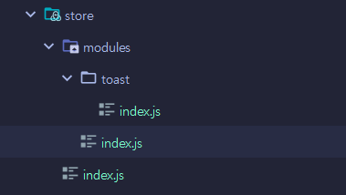

### 1. 사용하는 이유
alert, modal 등 전역에서 사용할때 scope를 넘어서 데이터나 function 적용이 불가하다.
같은 js에서 호출하더라도 값은 다르다.
간단한 depth를 가진 경우에는 emit을 사용하면되지만 복잡해질수록 그것은 불편해진다. 
이를 해결하기위해 vuex를 사용한다. (recoil, redux와 유사)
### 2. [설치하기](https://vuex.vuejs.org/installation.html#direct-download-cdn)
state management tool.
```dockerfile
npm install vuex@next --save
```
### 3. vuex로 관리할 데이터 모아두기
src/store directory
```javascript
import { createStore } from 'vuex';
export default createStore({
    state:{
        //전역에서 관리할 데이터
    }
})
```
main.js에 등록
```javascript
import { createApp } from 'vue'
import App from './App.vue'
import router from "@/router";
import store from "@/store";
createApp(App)
    .use(router)
    .use(store)
    .mount('#app');
```
### 4. vuex를 사용해 custom alert 사용하기
#### a. 사용할 state 객체로 보관하기
```javascript
export default createStore({
    state:{
        //전역에서 관리할 데이터
        showToast         : false, //default value
        toastMessage      : "",
        toastResStatus    : false,
        timeOut           : null,
    }
});
```
#### b. 사용할 곳에서 useState 접근
단, 단순히 값만 입력하면 변경사항이 반영되지 않음
```vue
<script>
  import {useStore} from "vuex";
  export default {
      setup(){
          const store = useStore();
          console.log(store.state.showToast);
      }
  }
</script>
```
### 5. ref => computed, mutations, actions, getters, modules 
#### a. computed
값 변경을 적용.
```javascript
import {useStore} from "vuex";

export const useToast= () => {
    //vuex store
    const store = useStore();
    const toastMessage = computed(()=>store.state.toastMessage);
    const toastResStatus = computed(()=>store.state.toastResStatus);
    const showToast = computed(()=>store.state.showToast);
    const timeOut = computed(()=>store.state.timeOut);
// Toast >
// const showToast = ref(false);
// const toastMessage = ref("");
// const toastResStatus = ref(false);
// const timeOut = ref(null);
//     ...
}
```
#### b. mutations: state 변경(setter)
단, mutations는 반드시 Synchronous(동기적 처리)

mutations로 미리 행동을 준비해두고
```javascript
export default createStore({
    state:{
        //전역에서 관리할 데이터
        showToast         : false,
        toastMessage      : "",
        toastResStatus    : false,
        timeOut           : null,
    },
    mutations: {
        UPDATE_TOAST_MESSAGE(state, payload){
            state.toastMessage = payload;
        },
        UPDATE_TOAST_STATUS(state, payload){
            state.toastResStatus = payload;
        },
        UPDATE_SHOW_TOAST_FLAG(state, payload){
            state.showToast = payload;
        },
        UPDATE_TOAST_TIMEOUT(state, payload){
            state.timeOut = payload;
        },
    },
});
```
store의 commit에 함수명을 입력
```vue
<script>
  export default {
      setup(){
          const currentMessage = "메세지를 전달";
        state.commit('UPDATE_TOAST_MESSAGE',currentMessage);
      }
  }
</script>
```
but mutaions 단독으로 쓰기보다 actions와 함께 사용
#### c. actions: state 변경 x, 비동기 처리 가능
mutations를 사용해 값 변경 처리
```javascript
    actions: {
    triggerToast (context, payload){
        const {commit} = context;
        const {message, toastResStatus} = payload;
        // console.log("store",payload);
        commit('UPDATE_TOAST_MESSAGE',message);
        commit('UPDATE_TOAST_STATUS',toastResStatus);
        commit('UPDATE_SHOW_TOAST_FLAG',true);
        //5초뒤 리셋
        setTimeout(()=>{
            commit('UPDATE_TOAST_MESSAGE','');
            commit('UPDATE_TOAST_STATUS','');
            commit('UPDATE_SHOW_TOAST_FLAG',false);
        },5000);
    },
```
사용할 곳에 적용
```javascript
    const triggerToast = (message,toastResStatus)=>{
    // payload에 사용되는 key값 주의
    store.dispatch('triggerToast', {message, toastResStatus});
}
```
#### d. getters: vuex에서 사용하는 computed
변경된 것을 감지해서 반영
```javascript
    },
    getters:{
        toastMessageWithSmile(state){
            return state.toastMessage+' :)';
        }
    }
//사용하는 곳
const toastMessage = computed(()=>store.getters.toastMessageWithSmile);
```
#### e. modules: 여러 state를 한번에 내보낼때 사용
```javascript
export default createStore({
    modules:{
        toast:{
            namespaced:true,//사용여부
            state:{
                //전역에서 관리할 데이터
                showToast         : false,
                toastMessage      : "",
                toastResStatus    : "",
            },
            mutations: {
                UPDATE_TOAST_MESSAGE(state, payload){
                    state.toastMessage = payload;
                },
                UPDATE_TOAST_STATUS(state, payload){
                    state.toastResStatus = payload;
                },
                UPDATE_SHOW_TOAST_FLAG(state, payload){
                    state.showToast = payload;
                },
            },
            actions: {
                triggerToast (context, payload){
                    const {commit} = context;
                    const {message, toastResStatus} = payload;
                    // console.log("store",payload);
                    commit('UPDATE_TOAST_MESSAGE',message);
                    commit('UPDATE_TOAST_STATUS',toastResStatus);
                    commit('UPDATE_SHOW_TOAST_FLAG',true);
                    //5초뒤 리셋
                    setTimeout(()=>{
                        commit('UPDATE_TOAST_MESSAGE','');
                        commit('UPDATE_TOAST_STATUS','');
                        commit('UPDATE_SHOW_TOAST_FLAG',false);
                    },5000);
                },
                // resetTimeOut({commit}){
                //     commit('UPDATE_TOAST_TIMEOUT',null);
                // }
            },
            getters:{//state를 밖으로 보낼때 별도의 getter를 지정할 수 있다.
                toastMessageWithSmile(state){
                    return state.toastMessage+' :)';
                }
            },
        },
        list: {
        //     ...
        },
        user: {
        //     ...
        }
    }
});
```
modules에 들어간 내용 꺼내쓰기
```asciidoc
    getter, dipatch...: store이름.메서드(['모듈이름/메서드이름']);
    state: store이름.모듈이름.state이름
```
```javascript
    const toastMessage = computed(()=>store.getters['toast/toastMessageWithSmile']);
    const toastResStatus = computed(()=>store.state.toast.toastResStatus);
    const triggerToast = (message,toastResStatus)=>{
        console.log("toastJS",{message,toastResStatus})
        store.dispatch('toast/triggerToast', {message, toastResStatus});
    }
```
#### f. 너무 많은 모듈이 있으면 관리가 어렵기에 폴더를 나눠 관리하는것이 좋음

```javascript
// 기존 store
import { createStore } from 'vuex';
import modules from "@/store/modules";
export default createStore({
    modules
});
// modules
import toast from './toast';
import user from './user';
import list from './list';
export default{
    toast: toast,
    user,
    list,
//     ...
}
```
