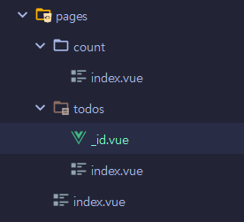

### 1. vue-router 사용
[npm 사이트](https://www.npmjs.com/package/vue-router)

### 2. 기본 설정
#### a. router 폴더
```javascript
const router = createRouter({
    history:createWebHistory(),//manage web history
    routes:[//page 정보
        {//하나의 객체가 하나의 라우트
            path        : '/',//url
            name        : 'home',//name
            component   : Home//해당 컴포넌트
        },
        {
            path        : '/todos',
            name        : 'Todo List',
            component   : Todos,
        },
        {
            path        : '/todos/:id', //pathParameter
            name        : 'Todo',
            component   : Todo
        }
    ],
});
export default router;
```
#### b. pages 폴더


pages 폴더가 router의 '/'링크, 

그 하위 폴더가 /이후의 path

```dockerfile
    /todos = pages.todos.index.vue
```

#### c. main.js에 router 등록
```javascript
import { createApp } from 'vue'
import App from './App.vue'
import router from "@/router";//라우터
createApp(App)
    .use(router)//사용
    .mount('#app');
```

#### d. router를 App.vue(최상위 컴포넌트) 등록
이동할때마다 변경됨
```vue
<!--  최상위 컴포넌트  -->
<template>
    <!-- router 등록 -->
  <router-view/> <!-- router에 등록한 pages 컴포넌트가 표시되는 곳 -->
        ...

```
#### e. 기존 작성 내용 중 페이지 내용을 pages하위로 이동
특히 Client Side Render인 경우 Page 쪽에서 하는 것을 권장

#### f. pathParam으로 링크 처리
useRoute를 사용
```vue
<template>
  <h1>Todo </h1>
</template>
<script setup>
  import {useRoute} from "vue-router";

  const route = useRoute();
  console.log(route.params.id);//이 값으로 페이지 내용 호출
</script>
```
#### g. 다른 element를 눌렀을때 이동하도록 처리
list로 반복되는 항목 내부에 이벤트리스너 추가
```vue
<template>
  <div
      v-for="(value,index) in todoList"
      :key="value.id"
      class="todoList card mt-2"
  >
    <div
        class="card-body p-2 d-flex align-items-center"
        @click="moveToPage(value.id)"
    >
        ...
```
script에서 id값을 받아 이동
```vue
<script >
import {useRouter} from "vue-router";
export default {
    setup(){
      const router = useRouter();
      const moveToPage = (id)=>{
        router.push(`/todos/${id}`);
      }
      return {
        moveToPage,
      }
    }
}
</script>
```
링크로 바로 연결할 경우 동적처리하는 방법
```vue
<router-link :to="{path: pageURL.freeBoard.detail + item.num }">
  {{item.title}}
</router-link>
```
router에 등록한 name으로도 이동가능
```vue
    <router-link class="navbar-brand" :to="{name: 'Home'}">Vue 3.0</router-link>
```
단, pathParameter가 필수인 경우 params를 obj로 추가해야함
```vue
<script setup>
  const moveToPage = (id)=>{
    // router.push(`/todos/${id}`);
    router.push({
      name:'Todo',
      params: {
        id: id,
      }
    })
  }
</script>
```
name을 사용하면 url 관리가 router에서만 이뤄져 편리.
#### h. 상세페이지
```vue
<template>
  <div v-if="loading">
    Loading...
  </div>
  <div v-else>
    <h1>Todo Page: {{ todo.id }}</h1>
    <form
        @submit.prevent="onSave"
    >
      <div class="row">
        <div class="col-8">
          <div class="form-group">
            <label for="subject">subject</label>
            <input v-model="todo.subject" type="text" id="subject" class="form-control"/>
          </div>
        </div>
        <div class="col-4">
          <div class="form-group">
            <div class="form-check">
              <label class="form-check-label">
                Status
              </label>
              <div class="completeBadge-container">
                <!--  공용으로 쓰는 class와 binding된 class를 나눠서 맥락평가로 처리가능  -->
                <span
                    class="completeBadge badge"
                    :class="todo.completed ? 'badge-success':'badge-warning'"
                    @click.stop="toggleStatus"
                >
                  {{ todo.completed ? "Completed" : "Incomplete" }}
                </span>
              </div>
            </div>
          </div>
        </div>
      </div>
      <hr/>
      <div class="container">
        <button type="submit" class="btn btn-outline-primary">Save</button>
        <button type="button" class="btn btn-danger ml-2" @click.stop="goList">Cancel</button>
        <button type="button" class="btn btn-outline-dark ml-2" @click.stop="resetTodo">Reset</button>
      </div>
    </form>
  </div>
</template>
<script>
export default{
    setup(){
      const route = useRoute();
      const router = useRouter();

      const todo = ref(null);
      let originTodo = {};
      const loading = ref(true);//loading처리
      const id = route.params.id;
      const getTodo = async ()=>{
        const res = await axios.get(`${host}/${id}`);
        if(res.status !== 200) throw Error("Not found");
        todo.value = res.data;
        originTodo = {...res.data};
        loading.value = false; //완료 후 loading flag 처리
      }

      const resetTodo= ()=>{
        todo.value = originTodo;
      }

      const goList =()=>{
        const check = confirm("수정한 내용이 저장되지 않습니다. 진행하시겠습니까?");
        if(check) {
          router.push("/todos");
          /* 이렇게도 가능
            router.push({
              name: "Todos"
            });
           */
        }
      }

      const toggleStatus = ()=>{
        todo.value.completed = !todo.value.completed;
      }

      const onSave = async () =>{
        const updateData = todo.value;
        const res = await axios.put(`${host}/${id}`,{ ...updateData });
        if(res.status !== 200) throw new Error("server Error: failed save");
        alert("success: update data");
      }
      return {
          todo,
          loading,
          getTodo,
          resetTodo, 
          goList,
          toggleStatus,
          onSave,
      }
    }
}
</script>
```
### 3. Navigation var
router-veiw tag에는 페이지 내용이 표시되므로 상단에 목차를 둘 경우 <router-view/> 위에 배치
```vue
<template>
  <Navbar/><!-- Navbar component-->
  <router-view/> <!-- Pages components -->
</template>
```
Navbar 내용은 bootstrap [예시](https://getbootstrap.com/docs/4.0/components/navbar/) 참고

a tag는 페이지 전체를 re-render시키므로 vue의 router-link를 사용, href대신 to attribut를 사용
```vue
<template>
  <nav class="navbar navbar-expand-lg navbar-light bg-light">
    <router-link class="navbar-brand" to="/">Vue 3.0</router-link>
    <ul class="navbar-nav mr-auto">
      <li class="nav-item">
        <router-link class="nav-link" to="/todos">Todo List</router-link>
      </li>
        ...
</template>
```
### 4. vue-router 작동원리
domain을 요청하게되면 서버에서 기본 index.html과 vue로 구성한 컴포넌트들이 한 파일로 조형되어 브라우저에 전달된다. 

a tag를 사용하면 마운트 시점에서 이미 호출한 내용을 다시 호출하게된다. 

router-view를 쓰면 페이지 요청을 가로채 이미 있는 데이터를 사용해 랜더한다. 

client side render

### 5. 이벤트 버블링
delete 버튼을 누르면 링크를 이동하는 이벤트와 삭제하는 이벤트가 곂치면서 삭제와 함께 페이지를 이동하게 됨 

하위의 삭제버튼에 click event가 발생하면 이것이 상위 element로 전달(이벤트 버블링)되면서 상위 element 중 하나인 detail page 이동 이벤트도 함께 진행됨
```vue
<template>
  <!-- 이벤트 버블링으로 인해 click event가 처리됨-->
  <div
      class="card-body p-2 d-flex align-items-center"
      @click="moveToPage(value.id)" 
  >
    <div class="form-check flex-grow-1">
      &emsp;
      <input
          class="form-check-input"
          type="checkbox"
          :checked="value.completed"
          @change="toggleTodo(index)"
      />
        &emsp;
      <label class="form-check-label">
        <h5
            class="todoLabel"
            :style="value.completed ? todoStyle:{}"
        >
          {{value.id}}. {{value.subject}}
        </h5>
      </label>
    </div>
    <div>
      <!-- 이벤트가 발생한 지점. 상위 Dom으로 버블링 -->
      <button
          class="btn btn-outline-danger btn-sm"
          @click="deleteTodo(index)"
      >
        Delete
      </button>
    </div>
  </div>
</template>
```
이를 방지하기 위해

js에서는 stopPropagation 사용
```javascript
    event.stopPropagation();
```

vue.js에서는 event에 stop으로 표시(preventDefault와 같음)
```vue
<template>
  <button
      class="btn btn-outline-danger btn-sm"
      @click.stop="deleteTodo(index)"
  >
    Delete
  </button>
<!-- check box, radio button 모두 마찬가지 -->
  <input
      class="form-check-input"
      type="checkbox"
      :checked="value.completed"
      @change="toggleTodo(index, $event)"
      @click.stop
  />
</template>
```
* 참고 $event는 개별 발생한 이벤트 객체를 받을 때 사용
