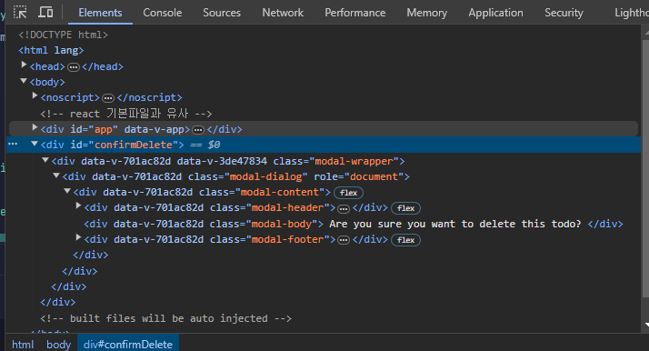

### 1. [Teleport](https://vuejs.org/guide/built-ins/teleport.html#teleport)
local component 내의 컴포넌트를 전역변수화 시켜 global하게 사용할수 있게함
#### a. 대상 컴포넌트를 <Teleport>로 감싼다.
```vue
  <teleport to="#confirmDelete">
  <Modal
      v-if="modalFlag"
      @closeModal="closeModal"
      @deleteTodo="deleteTodo"
  />
</teleport>
```
#### b. 최상위 html(index.html)에 id 지정
```html
<!DOCTYPE html>
<html lang="">
<head>
    <meta charset="utf-8">
    <meta http-equiv="X-UA-Compatible" content="IE=edge">
    <meta name="viewport" content="width=device-width,initial-scale=1.0">
    <link rel="stylesheet" href="https://stackpath.bootstrapcdn.com/bootstrap/4.5.2/css/bootstrap.min.css">
    <title><%= htmlWebpackPlugin.options.title %></title>
</head>
<body>
<noscript>
    <strong>We're sorry but <%= htmlWebpackPlugin.options.title %> doesn't work properly without JavaScript enabled. Please enable it to continue.</strong>
</noscript>
<div id="app"></div>
<!-- component by global -->
<div id="confirmDelete"></div>
</body>
</html>
```
#### c. 컴포넌트 위치를 최상위로 올린 상태

```asciidoc
    부모 컴포넌트의 style에 영향을 받지 않는다. 
    to=""에는 querySelector를 사용할 수 있으나 class는 다중 선택이 되므로 id 권장
```
#### d. toast에 사용한 경우
```vue
  <teleport to="#resultAlert">
      <transition name="infoSlide">
        <Toast
            v-show="showToast"
            :message="toastMessage"
            :status="toastResStatus"
        />
      </transition>
</teleport>
```
### 2. [Slot](https://vuejs.org/guide/components/slots.html#slots)
반복적으로 사용되는 element나 문자열 등이 있을때 이를 slot으로 처리할 수 있다. 
#### a. tag의 content만 단순전달하는 경우
값을 전달할 위치에 slot tag
```vue
  <h5 class="modal-title" id="exampleModalLabel">
      <slot></slot>
    </h5>
```
해당 컴포넌트가 호출되는 곳의 context에 내용 입력
```vue
<teleport to="#confirmDelete">
  <Modal
      v-if="modalFlag"
      @closeModal="closeModal"
      @deleteTodo="deleteTodo"
  >
    <!--  tag content  -->
    Delete todo?
  </Modal>
</teleport>
```
#### b. 여러 값을 보내고 싶은 경우
slot tag에 name attribute로 표기하고 
```vue
<div class="modal-body">
  <slot name="modalBody"></slot>
</div>
```
값을 입력
```vue
<Modal
    v-if="modalFlag"
    @closeModal="closeModal"
    @deleteTodo="deleteTodo"
>
  <template v-slot:modalTitle>
    Delete todo?
  </template>
  <template v-slot:modalBody>
    Are you sure?
  </template>
</Modal>
```
element를 전달하는 것도 가능
```vue
<template v-slot:modalExecuteBtn>
  <button type="button" class="btn btn-danger">
    Delete
  </button>
</template>
```
#### c. 공용을 만들고 기능에 맞게 컴포넌트 적용하기
```vue
<template>
  <Modal>
    <template v-slot:modalTitle>
      Delete todo?
    </template>
    <template v-slot:modalBody>
      Are you sure?
    </template>
    <template v-slot:modalExecuteBtn>
      <button
          type="button"
          class="btn btn-danger"
          @click="onDelete"
      >
        Delete
      </button>
    </template>
  </Modal>
</template>

<script>
import Modal from "@/components/Modal.vue";
export default {
  components:{
    Modal,
  },
  setup(props,{emit}){
    const onDelete = ()=>{
      emit('deleteTodo');
    }
    return{
      onDelete,
    }
  }
}
</script>

<style scoped>

</style>
```
